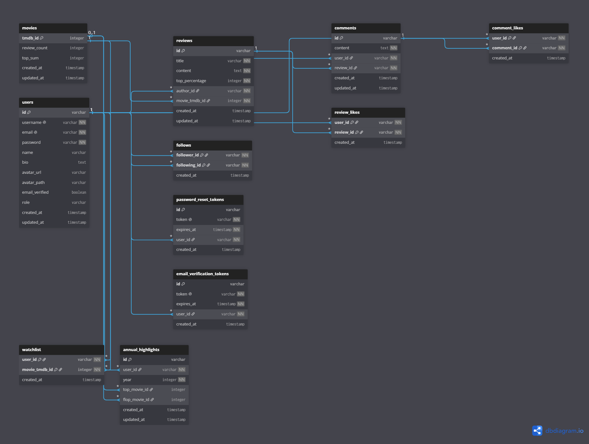

# Plataforma de Rede Social para Análise de Filmes

Este projeto consiste em uma API desenvolvida com **NestJS** para uma plataforma social voltada à publicação de análises de filmes, interação entre usuários e construção de uma comunidade de cinéfilos.

A aplicação foi projetada utilizando arquitetura modular, autenticação segura e banco de dados relacional, permitindo escalabilidade, organização e fácil manutenção.

---

# Principais funcionalidades

## Sistema de autenticação

Autenticação segura utilizando **JWT**, permitindo:

- Cadastro de usuários
- Login
- Proteção de rotas privadas
- Controle de permissões por papéis (USER e ADMIN)

---

## Gerenciamento de usuários

Os usuários podem:

- Criar perfil
- Alterar informações pessoais
- Definir foto de perfil
- Escrever biografia
- Confirmar endereço de email

---

## Sistema de avaliações de filmes

Cada usuário pode publicar apenas uma análise para cada filme.

As avaliações possuem:

- Título
- Conteúdo
- Nota em porcentagem (Top %)
- Data de criação
- Data de atualização

Cada avaliação está vinculada a um filme através do **TMDB ID**, evitando duplicação de informações da API do TMDB.

---

## Sistema de comentários

As avaliações podem receber comentários de outros usuários.

Cada comentário possui:

- Autor
- Conteúdo
- Data de criação
- Data de atualização

---

## Sistema de curtidas

A plataforma permite interação através de curtidas em:

- Avaliações
- Comentários

Cada usuário pode curtir apenas uma vez cada conteúdo.

---

## Sistema de seguidores

Os usuários podem seguir outros usuários para acompanhar suas publicações.

O relacionamento é do tipo muitos-para-muitos, permitindo:

- Lista de seguidores
- Lista de pessoas seguidas

---

## Lista de interesse (Watchlist)

Permite ao usuário gerenciar os filmes que ele deseja assistir no futuro:

- Adicionar filmes à lista através do TMDB ID
- Listar todos os filmes salvos na watchlist do perfil
- Remover filmes da lista de interesse
- Restrição automática para evitar a duplicação do mesmo filme na lista do usuário

---

## Destaques anuais (Top & Flop do Ano)

Uma funcionalidade inspirada nos "4 favoritos" do Letterbox, porém focada no desempenho anual:

- O usuário pode definir o seu filme **"Top"** (Melhor do ano) e o seu filme **"Flop"** (Pior do ano)
- Histórico controlado por ano (armazenado de forma inteira) calculado dinamicamente no serviço
- Chave composta única que garante estritamente **apenas um registro de destaques por usuário a cada ano**

---

## Recuperação de senha

Fluxo completo para redefinição de senha utilizando tokens temporários.

O sistema utiliza **Resend + React Email** para automatizar todo o processo, incluindo:

- Solicitação de recuperação de senha
- Envio do email com link de redefinição
- Geração de token temporário
- Expiração automática do token
- Validação do token
- Redefinição segura da senha

---

## Verificação de email

Após o cadastro, os usuários devem confirmar seu endereço de email antes da ativação da conta.

O fluxo é realizado utilizando **Resend + React Email**, permitindo:

- Envio automático do email de verificação
- Geração de token único
- Validação do token
- Confirmação do endereço de email
- Ativação da conta

---

## Redis para performance e escalabilidade

A aplicação utiliza **Redis** para melhorar a performance e a escalabilidade da API, sendo empregado em funcionalidades como:

- Cache de dados estratégicos
- Rate Limiting
- Controle de sessões
- Armazenamento temporário de dados
- Otimização de operações frequentes

---

# Tecnologias utilizadas

- NestJS
- TypeScript
- PostgreSQL
- Prisma ORM
- JWT Authentication
- Redis
- Resend
- React Email
- Bcrypt
- Class Validator
- Class Transformer

---

# Caso de uso do projeto

A proposta da aplicação é simular uma rede social voltada para cinéfilos, onde usuários podem compartilhar opiniões sobre filmes, interagir com outras pessoas e construir um histórico de avaliações.

O sistema utiliza o **TMDB (The Movie Database)** como fonte de identificação dos filmes, mantendo apenas as informações necessárias para relacionamento das avaliações no banco de dados.

---

# Arquitetura do sistema

A aplicação foi dividida em módulos independentes, seguindo os princípios de responsabilidade única e organização por domínio (Subdomínios de Contexto).

## Módulos

### 01 - AUTH

Responsável por:

- Login
- Cadastro
- JWT
- Refresh de autenticação

---

### 02 - USERS

Gerenciamento de usuários.

- Perfil
- Avatar
- Biografia
- Permissões

---

### 03 - CINEMA (Domínio Agrupador)

Subdomínio que centraliza o catálogo de filmes e as interações diretas do perfil do usuário com as obras cinematográficas. Dividido em três submódulos internos:

- **Movies**: Gerenciamento dos filmes base na plataforma (TMDB ID, estatísticas e contagem de reviews).
- **Watchlist**: Sistema de controle de filmes que o usuário salvou para assistir posteriormente.
- **Highlights**: Lógica de definição e controle do Top e Flop anual de filmes de cada usuário.

---

### 04 - REVIEWS

Responsável pelas avaliações dos filmes.

- Publicação
- Atualização
- Exclusão
- Consulta

---

### 05 - COMMENTS

Comentários das avaliações.

---

### 06 - LIKES

Curtidas de avaliações e comentários.

---

### 07 - FOLLOWS

Relacionamento entre usuários.

---

### 08 - PASSWORD RESET

Fluxo de recuperação de senha.

---

### 09 - EMAIL VERIFICATION

Confirmação de email dos usuários.

---

# Arquitetura do banco de dados

O banco de dados foi modelado utilizando **PostgreSQL** e **Prisma ORM**, contemplando autenticação, relacionamentos sociais, avaliações, comentários, curtidas, seguidores, listas de interesse e gerenciamento de contas.

### Esquema do Banco de Dados

---

# Objetivos do projeto

- Demonstrar arquitetura modular utilizando NestJS
- Aplicar boas práticas de desenvolvimento back-end
- Utilizar relacionamentos complexos com Prisma ORM
- Construir uma API REST escalável
- Simular funcionalidades presentes em redes sociais modernas
- Integrar dados externos através do TMDB
